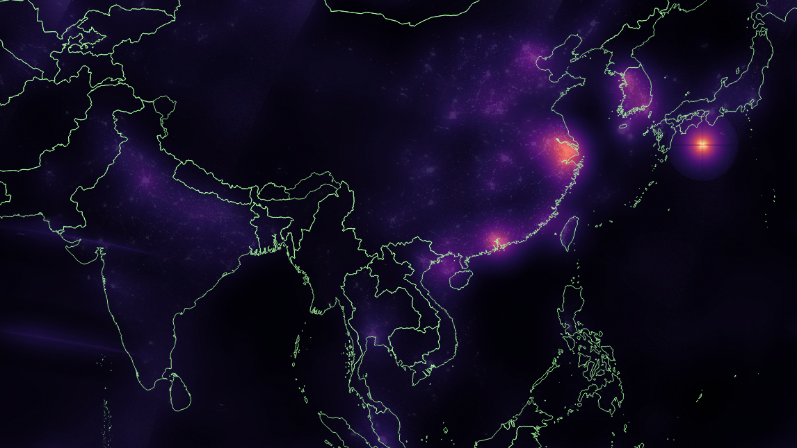

## Skyglow FFT - Fast Fourier Transform based pipeline for calculation of skyglow extent

This Python script calculates **horizontal** skyglow from VIIRS-DNB images via a simple convolution
using a Fast Fourier Transform (FFT), as opposed to usual, inefficient pixel-by-pixel methods.

### Setup

The dependencies for the scripts are:

1. [Numpy](https://numpy.org/install/) - Mathematical functionality and Linear Algebra
2. [Rasterio](https://github.com/mapbox/rasterio) - Raster manipulation 
3. [Matplotlib](https://matplotlib.org/) - Data Visualisation
4. [Tqdm](https://github.com/tqdm/tqdm) - Progress Bars
5. [TOML](https://github.com/uiri/toml) - Python TOML parser

The necessary libraries can be installed via: `pip install -r requirements.txt`

### Running the script

To run the script, use `python main.py`. 

Please, ensure you set up the correct paths, directories and model parameters in the `settings.toml` file.

Example output:

### Background

More information on the method can be found in:

Bará, et al. (2019), "Fast Fourier-transform calculation of artificial night sky brightness maps"

Available at: https://arxiv.org/abs/1907.02891